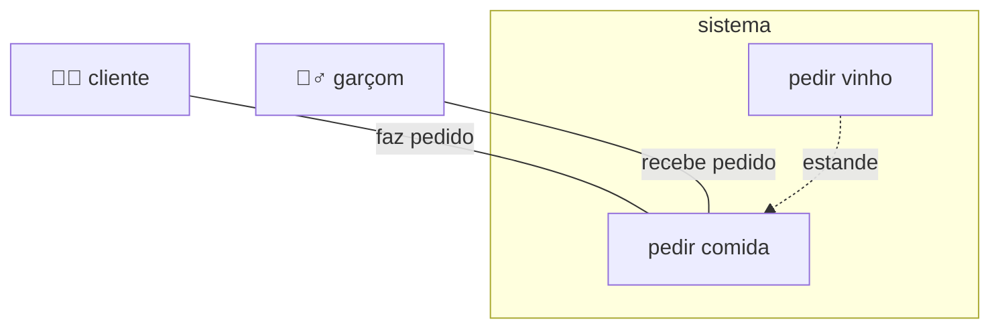
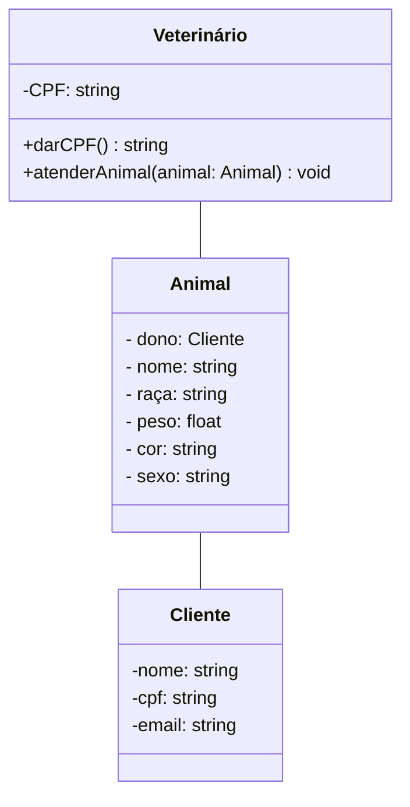

# trabalho-engenharia-software

Trabalho de Engenharia de Software do Prof Henry em 2026-02

Este repositório é onde vou guardar meu trabalho da disciplina de Engenharia de Software.

## Diagrama UML

### Diagrama de Classe

